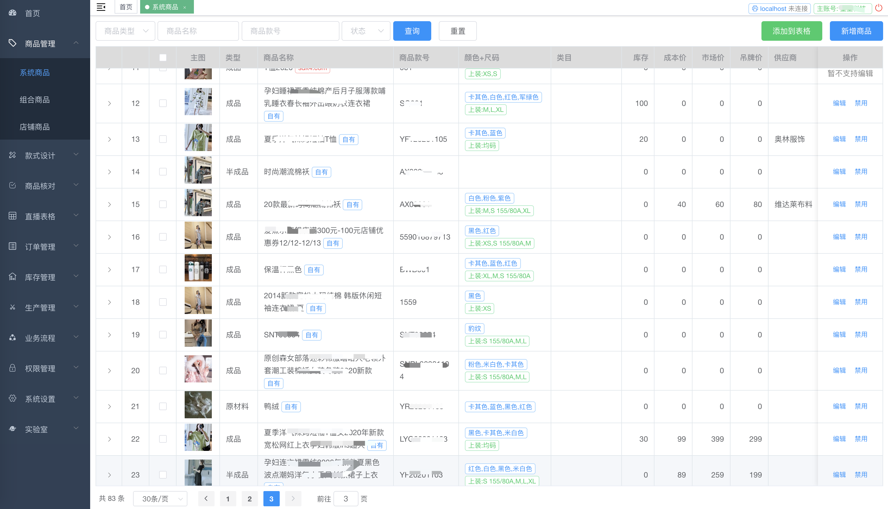
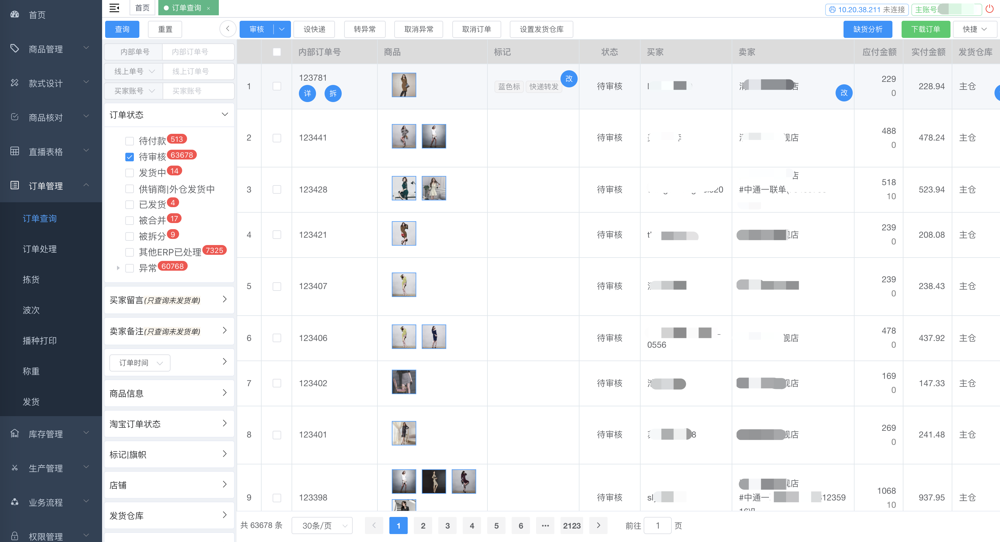
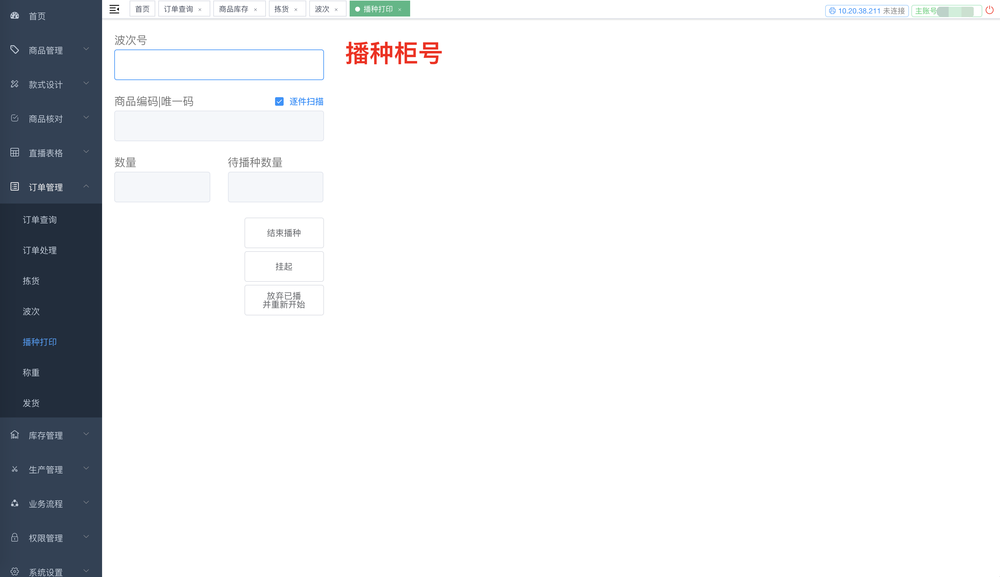
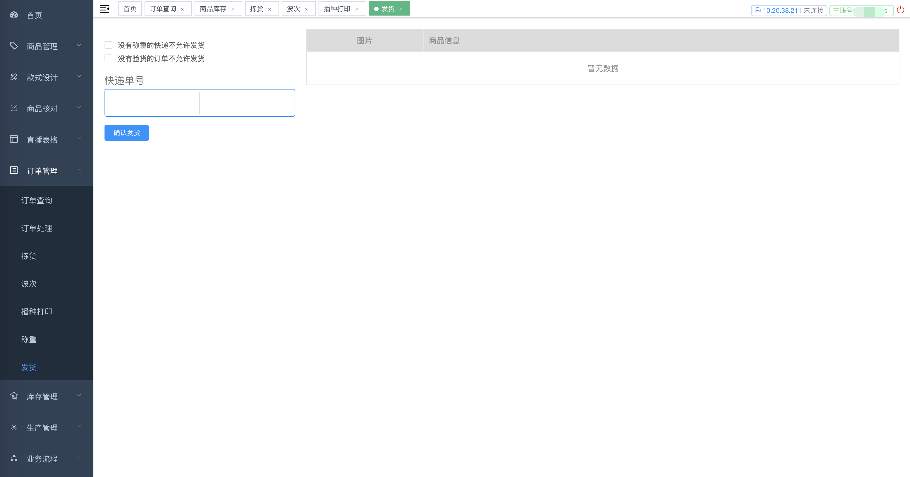

# 抖店SDK

抖音-抖店开放平台SDK，<https://op.jinritemai.com/>。

该 SDK 已实现 API 接口调用和消息推送验证解析，SDK 仅依赖 [fastjson](https://github.com/alibaba/fastjson) 来做 JSON 格式数据的解析。

## API 接口

该 SDK 适用于自用型应用和工具型应用，他们的差别仅存在于获取授权的方式不一样：

### 获取调用 Client

- **自用型应用**

    对于自用型应用，不需要传 access token，SDK 中会自动进行 access token 的获取以及刷新处理（<https://op.jinritemai.com/docs/guide-docs/9/21>）。

      DoudianClient client = new DefaultDoudianClient(serverUrl, appKey, appSecret);

- **工具型应用**

    工具型应用授权说明：<https://op.jinritemai.com/docs/guide-docs/9/22>

    对应工具型应用，判断店铺是否已经授权，未授权需要先进行授权，授权成功后需要将相关授权信息存储下来以便后续调用或者 access token 过期后进行刷新。

    - 店铺授权(未授权或授权过期)

        用户授权成功后，回调配置的地址，并返回 code 参数（url参数）。使用 code 换取 access token 等授权信息。

          DoudianClient client = new DefaultDoudianClient(serverUrl, appKey, appSecret);
          if (!accessToken.isSuccess()) {
              // code 换取 access token 失败
          } else {
              // 存储该授权店铺的信息
              // accessToken 授权token
              // expiresIn 有效期(秒)
              // shopId 店铺id
              // shopName 店铺名
              // refreshToken 刷新token
              // 计算 access token 过期时间（向前推1分钟）
              int expiresIn = accessToken.getExpiresIn();
              long expire = System.currentTimeMillis() + (expiresIn - 60) * 1000;
              // 将上述相关信息进行存储
          }

    - 根据授权信息获取 DoudianClient

        根据店铺id获取该店铺授权信息，判断 access token 是否已过期，过期则使用 refresh token 刷新授权，并将新的授权信息进行存储，以便后续使用。

          DoudianClient client = new DefaultDoudianClient(serverUrl, appKey, appSecret);
          
          // 根据店铺id获取店铺授权信息，并创建 accessToken 对象
          DoudianAccessToken accessToken = new DoudianAccessToken();
          accessToken.setAccessToken(店铺授权token);
          accessToken.setExpiresIn(店铺授权token过期时间);
          accessToken.setExpire(店铺授权token过期时间点);
          accessToken.setRefreshToken(店铺授权刷新token);

          client.setAccessToken(accessToken);
          if (!accessToken.isValid()) {
              accessToken = client.getAccessToken(accessToken.getRefreshToken());
              if (accessToken.isValid()) {
                  // 存储该店铺新的授权信息
                  // accessToken 授权token
                  // expiresIn 有效期(秒)
                  // shopId 店铺id
                  // shopName 店铺名
                  // refreshToken 刷新token
                  // 计算 access token 过期时间（向前推1分钟）
                  int expiresIn = accessToken.getExpiresIn();
                  long expire = System.currentTimeMillis() + (expiresIn - 60) * 1000;
              }
          }
          if (!accessToken.isValid()) {
              // 授权获取失败
              throw new RuntimeException("授权获取失败");
          }
          client.setAccessToken(accessToken);

### SDK 调用类名规则

- 请求类：将 method 参数，转换成相应的首字母大写驼峰名，然后加 `Doudian` 前缀，加 `Request` 后缀，即为 API 请求对象类名，例如：获取订单列表接口，method 为 `order.list`，转换为首字母大写驼峰 `OrderList`，再加前缀/后缀后，请求类名 `DoudianOrderListRequest`
- 响应类：将 method 参数，转换成相应的首字母大写驼峰名，然后加 `Doudian` 前缀，加 `Response` 后缀，即为 API 请求对象类名，例如：获取订单列表接口，method 为 `order.list`，转换为首字母大写驼峰 `OrderList`，再加前缀/后缀后，响应类名 `DoudianOrderListResponse`
- 调用方式：

      // 创建 client，自用型应用或工具型应用创建方式略有不同，详解上一节说明
      DoudianClient client = getClient();
      // 构建请求类
      请求类 request = new 请求类();
      // 设置请求参数
      request.setXX1();
      request.setXX2();
      request.setXX3();
      ......
      // 调用 API
      响应类 response = client.execute();
      if (response.isSuccess()) {
          // 调用成功，进行业务处理
      } else {
          // 调用失败，进行错误处理
          // 错误代码：response.getErrNo();
          // 错误信息：response.getMessage();
      }
- 对返回值的一些说明

    - 目前已知接口，返回结构均为：

          {
              "err_no": 0, // 返回代码，0 表示成功；非 0 表示失败
              "message": "success", // err_no 非 0 时表示调用错误信息
              "data": 返回的业务数据(可能是各种结构)
          }

    - 对于分页类数据的返回，各个接口使用的参数名不一样，比如：获取商品列表接口将数据列表放在 `data` 上，而获取订单列表接口则将数据列表放在 `list` 上，为了统一处理分页类数据返回，可以通过如下方法来统一返回分页相关信息：

          DoudianPage<业务数据类> page = response.getData();
          page.getTotal(); // 总记录数
          page.getPageNumber(); // 当前页数
          page.getPageSize(); // 页大小
          List<业务数据类> list = page.getPageData(); // 业务数据列表

### 店铺API

#### 获取店铺的已授权品牌列表

**API 接口：**<https://op.jinritemai.com/docs/api-docs/13/54>

```
DoudianShopBrandListRequest request = new DoudianShopBrandListRequest();
DoudianShopBrandListResponse response = getClient().execute(request);
if (response.isSuccess()) {
    List<DoudianShopBrand> shopBrandList = response.getData();
    System.out.println("获取品牌信息：" + shopBrandList.size());
} else {
    System.out.println("获取失败：" + response.getMessage());
}
```

#### 获取店铺后台供商家发布商品的类目

**API 接口：**<https://op.jinritemai.com/docs/api-docs/13/234>

```
DoudianShopGetShopCategoryRequest request = new DoudianShopGetShopCategoryRequest();
request.setCid(0L);
DoudianShopGetShopCategoryResponse response = getClient().execute(request);
if (!response.isSuccess()) {
    System.out.println("获取失败：" + response.getMessage());
} else {
    for (DoudianShopCategory shopCategory : response.getData()) {
        System.out.print(repeat(" ", (shopCategory.getLevel() - 1) * 2));
        System.out.println(shopCategory.getId() + "," + shopCategory.getName());
    }
}
```

### 商品API

#### 获取商品详情

**API 接口：**<https://op.jinritemai.com/docs/api-docs/14/56>

```
DoudianProductDetailRequest request = new DoudianProductDetailRequest();
request.setProductId(3453347975240268172L);
DoudianProductDetailResponse response = getClient().execute(request);
if (!response.isSuccess()) {
    System.err.println("获取商品详情失败:" + response.getMessage());
} else {
    DoudianProduct product = response.getData();
    System.out.println(JSON.toJSONString(product));
}
```

#### 获取商品列表

**API 接口：**<https://op.jinritemai.com/docs/api-docs/14/57>

```
DoudianProductListRequest request = new DoudianProductListRequest();
DoudianProductListResponse response = getClient().execute(request);
if (!response.isSuccess()) {
    System.err.println("获取商品列表失败:" + response.getMessage());
} else {
    for (DoudianProduct product : response.getData().getPageData()) {
        System.out.println(JSON.toJSONString(product));
    }
}
```

#### 添加商品

**API 接口：**<https://op.jinritemai.com/docs/api-docs/14/59>

```
DoudianProductAddRequest request = new DoudianProductAddRequest();
request.setName("米奇牛仔裤");
request.setPic("https://sf6-ttcdn-tos.pstatp.com/obj/temai/2d5bb85c2e7f919f403ed6372a8ddc9fwww800-800");
request.setDescription("https://sf6-ttcdn-tos.pstatp.com/obj/temai/2d5bb85c2e7f919f403ed6372a8ddc9fwww800-800");
request.setMarketPrice(10000);
request.setDiscountPrice(10000);
request.setMobile("13400000001");
request.setWeight("110");
request.setProductFormat("{\"货号\":\"KZZL025\",\"适用季节\":\"冬季\"}");
request.setPayType(1);
request.setSpecId("134794584");
request.setCategoryLeafId("20597");
DoudianProductAddResponse response = getClient().execute(request);
if (!response.isSuccess()) {
    System.err.println("添加商品失败:" + response.getMessage());
} else {
    System.out.println("添加商品成功:" + response.getData().getProductId());
}
```

#### 编辑商品

**API 接口：**<https://op.jinritemai.com/docs/api-docs/14/60>

```
DoudianProductEditRequest request = new DoudianProductEditRequest();
request.setProductId(1L);
request.setName("米奇牛仔裤");
request.setPic("https://sf6-ttcdn-tos.pstatp.com/obj/temai/2d5bb85c2e7f919f403ed6372a8ddc9fwww800-800");
request.setDescription("https://sf6-ttcdn-tos.pstatp.com/obj/temai/2d5bb85c2e7f919f403ed6372a8ddc9fwww800-800");
request.setMarketPrice(10000);
request.setDiscountPrice(10000);
request.setMobile("13400000001");
request.setWeight("110");
request.setProductFormat("{\"货号\":\"KZZL025\",\"适用季节\":\"冬季\"}");
request.setPayType(1);
request.setSpecId("134794584");
request.setCategoryLeafId("20597");
DoudianProductEditResponse response = getClient().execute(request);
if (!response.isSuccess()) {
    System.err.println("编辑商品失败:" + response.getMessage());
} else {
    System.out.println("编辑商品成功");
}
```

#### 删除商品

**API 接口：**<https://op.jinritemai.com/docs/api-docs/14/61>

```
DoudianProductDelRequest request = new DoudianProductDelRequest();
request.setProductId(1L);
DoudianProductDelResponse response = getClient().execute(request);
if (!response.isSuccess()) {
    System.err.println("删除商品失败:" + response.getMessage());
} else {
    System.out.println("删除商品成功");
}
```

#### 添加规格

**API 接口：**<https://op.jinritemai.com/docs/api-docs/14/62>

```
DoudianSpecAddRequest request = new DoudianSpecAddRequest();
request.setSpecs("颜色|白色,红色,蓝色^尺码|S,M,L");
request.setName("规格2021-1");
DoudianSpecAddResponse response = getClient().execute(request);
if (!response.isSuccess()) {
    System.err.println("添加规格失败:" + response.getMessage());
} else {
    System.out.println("添加规格成功");
}
```

#### 获取规格详情

**API 接口：**<https://op.jinritemai.com/docs/api-docs/14/63>

```
DoudianSpecSpecDetailRequest request = new DoudianSpecSpecDetailRequest();
request.setId(145957862L);
DoudianSpecSpecDetailResponse response = getClient().execute(request);
if (!response.isSuccess()) {
    System.err.println("获取规格详情失败:" + response.getMessage());
} else {
    for (DoudianSpec spec : response.getData()) {
        System.out.println(JSON.toJSONString(spec));
    }
}
```

#### 获取规格列表

**API 接口：**<https://op.jinritemai.com/docs/api-docs/14/64>

```
DoudianSpecListRequest request = new DoudianSpecListRequest();
DoudianSpecListResponse response = getClient().execute(request);
if (!response.isSuccess()) {
    System.err.println("获取规格列表失败:" + response.getMessage());
} else {
    for (DoudianSpec spec : response.getData()) {
        System.out.println(JSON.toJSONString(spec));
    }
}
```

#### 删除规格

**API 接口：**<https://op.jinritemai.com/docs/api-docs/14/65>

```
DoudianSpecDelRequest request = new DoudianSpecDelRequest();
request.setId(145957862L);
DoudianSpecDelResponse response = getClient().execute(request);
if (!response.isSuccess()) {
    System.err.println("删除规格失败:" + response.getMessage());
} else {
    System.out.println("删除规格成功");
}
```

#### 添加SKU

**API 接口：**<https://op.jinritemai.com/docs/api-docs/14/81>

```
DoudianSkuAddRequest request = new DoudianSkuAddRequest();
request.setProductId(3453183170894243915L);
request.setSpecId(115584464L);
request.setSpecDetailIds("981648008|981648010");
request.setStockNum(1);
request.setPrice(10100);
DoudianSkuAddResponse response = getClient().execute(request);
if (!response.isSuccess()) {
    System.err.println("添加SKU失败:" + response.getMessage());
} else {
    System.out.println("添加SKU成功");
}
```

#### 获取商品sku列表

**API 接口：**<https://op.jinritemai.com/docs/api-docs/14/82>

```
DoudianSkuListRequest request = new DoudianSkuListRequest();
request.setProductId(3453347975240268174L);
DoudianSkuListResponse response = getClient().execute(request);
if (!response.isSuccess()) {
    System.err.println("获取商品sku列表失败:" + response.getMessage());
} else {
    for (DoudianSku sku : response.getData()) {
        System.out.println(JSON.toJSONString(sku));
    }
}
```

### 订单API

#### 获取订单列表

**API 接口：**<https://op.jinritemai.com/docs/api-docs/15/55>

```
DoudianOrderListRequest request = new DoudianOrderListRequest();
request.setStartTime("2020-12-01 00:00:00");
request.setEndTime("2020-12-31 00:00:00");

DoudianOrderListResponse response = getClient().execute(request);
if (!response.isSuccess()) {
    System.err.println("获取订单列表失败:" + response.getMessage());
} else {
    DoudianPage<DoudianOrder> page = response.getData();
    for (DoudianOrder order : page.getPageData()) {
        System.out.println(JSON.toJSONString(order));
    }
}
```

#### 获取订单详情

**API 接口：**<https://op.jinritemai.com/docs/api-docs/15/68>

```
DoudianOrderDetailRequest request = new DoudianOrderDetailRequest();
request.setOrderId("4736605172296554197A");
DoudianOrderDetailResponse response = getClient().execute(request);
if (!response.isSuccess()) {
    System.err.println("获取订单详情失败:" + response.getMessage());
} else {
    DoudianPage<DoudianOrder> page = response.getData();
    for (DoudianOrder order : page.getPageData()) {
        System.out.println(JSON.toJSONString(order));
    }
}
```

#### 确认货到付款订单

**API 接口：**<https://op.jinritemai.com/docs/api-docs/15/69>

```
DoudianOrderStockUpRequest request = new DoudianOrderStockUpRequest();
request.setOrderId("4736605172296554197A");
DoudianOrderStockUpResponse response = getClient().execute(request);
if (!response.isSuccess()) {
    System.err.println("确认货到付款订单失败:" + response.getMessage());
} else {
    System.out.println("确认货到付款订单成功");
}
```

#### 取消货到付款订单

**API 接口：**<https://op.jinritemai.com/docs/api-docs/15/72>

```
DoudianOrderCancelRequest request = new DoudianOrderCancelRequest();
request.setOrderId("4736605172296554197A");
DoudianOrderCancelResponse response = getClient().execute(request);
if (!response.isSuccess()) {
    System.err.println("取消货到付款订单失败:" + response.getMessage());
} else {
    System.out.println("取消货到付款订单成功");
}
```

#### 获取服务请求列表

**API 接口：**<https://op.jinritemai.com/docs/api-docs/15/74>

```
DoudianOrderServiceListRequest request = new DoudianOrderServiceListRequest();
DoudianOrderServiceListResponse response = getClient().execute(request);
if (!response.isSuccess()) {
    System.err.println("获取服务请求列表失败:" + response.getMessage());
} else {
    System.out.println("获取服务请求列表成功");
}
```

#### 回复服务请求

**API 接口：**<https://op.jinritemai.com/docs/api-docs/15/75>

```
DoudianOrderReplyServiceRequest request = new DoudianOrderReplyServiceRequest();
request.setId("1");
request.setReply("回复信息");
DoudianOrderReplyServiceResponse response = getClient().execute(request);
if (!response.isSuccess()) {
    System.err.println("回复失败:" + response.getMessage());
} else {
    System.out.println("回复成功");
}
```

#### 添加订单备注

**API 接口：**<https://op.jinritemai.com/docs/api-docs/15/141>

```
DoudianOrderAddOrderRemarkRequest request = new DoudianOrderAddOrderRemarkRequest();
request.setOrderId("4736605172296554197A");
request.setRemark("sh订单");
request.setIsAddStar(true);
request.setStar(1);
DoudianOrderAddOrderRemarkResponse response = getClient().execute(request);
if (!response.isSuccess()) {
    System.err.println("添加订单备注失败:" + response.getMessage());
} else {
    System.out.println("添加订单备注成功");
}
```

### 物流发货API

#### 获取快递公司列表

**API 接口：**<https://op.jinritemai.com/docs/api-docs/16/76>

```
DoudianOrderLogisticsCompanyListRequest request = new DoudianOrderLogisticsCompanyListRequest();
DoudianOrderLogisticsCompanyListResponse response = getClient().execute(request);
if (!response.isSuccess()) {
    System.err.println("获取快递公司列表失败:" + response.getMessage());
} else {
    for (DoudianOrderLogisticsCompany logisticsCompany : response.getData()) {
        System.out.println(JSON.toJSONString(logisticsCompany));
    }
}
```

#### 订单发货

**API 接口：**<https://op.jinritemai.com/docs/api-docs/16/77>

```
DoudianOrderLogisticsAddRequest request = new DoudianOrderLogisticsAddRequest();
request.setOrderId("4736605172296524197A");
request.setLogisticsId(15L);
request.setCompany("中通快递");
request.setLogisticsCode("75417914223203");
DoudianOrderLogisticsAddResponse response = getClient().execute(request);
if (!response.isSuccess()) {
    System.err.println("发货失败:" + response.getMessage());
} else {
    System.out.println("发货成功");
}
```

#### 修改发货物流

**API 接口：**<https://op.jinritemai.com/docs/api-docs/16/79>

```
DoudianOrderLogisticsEditRequest request = new DoudianOrderLogisticsEditRequest();
request.setOrderId("4736605172296524197A");
request.setLogisticsId(15L);
request.setCompany("中通快递");
request.setLogisticsCode("75417914223203");
DoudianOrderLogisticsEditResponse response = getClient().execute(request);
if (!response.isSuccess()) {
    System.err.println("修改发货物流失败:" + response.getMessage());
} else {
    System.out.println("修改发货物流成功");
}
```

### 售后退款API

### 运费险API

### 库存API

### 账单API

## 消息推送

消息推送服务接入指南：<https://op.jinritemai.com/docs/guide-docs/10/99>

使用 SDK 验证解析抖店消息推送示例：

    @PostMapping(抖音店铺数据推送URL，主要需要去掉权限验证)
    public DouyinPushResult<Map> doudianShopDataPush(HttpServletRequest httpRequest,
                                                     HttpServletResponse httpResponse) {
        DoudianPushResult result = new DoudianPushResult();
        DoudianPushMessage pushMessage = DoudianUtils.getPushMessage(httpRequest);
        if (!pushMessage.isSuccess()) {
            result.setCode(40041);
            result.setMsg("解析推送数据失败");
        } else if (DoudianUtils.isEmpty(pushMessage.getData())) {
            result.setCode(40041);
            result.setMsg("解析推送数据为空");
        } else {
            List<DoudianPushData> pushDataList = pushMessage.getData();
            // 推送地址添加后，平台会立即Post一条"[{"tag":"0","msg_id":"0","data":"2020-09-10T16:27:56.52842897+08:00"}]"的测试消息，
            // 必须返回{"code":0,"msg":"success"}
            if (pushDataList.size() == 1 && "0".equals(pushDataList.get(0).getTag())) {
                result.setCode(0);
                result.setMsg("success");
            } else {
                // 业务处理
                for (DoudianPushData pushData : pushDataList) {
                    if ("100".equals(pushData.getTag())) {
                        DoudianTradeTradeCreate100 tradeCreate100 = pushData.toObject(DoudianTradeTradeCreate100.class);
                        // 具体业务处理
                    }
                }
                if (true) {
                    // 接收处理成功
                    result.setCode(0);
                    result.setMsg("success");
                } else {
                    // 接收处理失败
                    result.setCode(40044);
                    result.setMsg("接收处理失败消息");
                }
            }
        }
        return result;
    }

## 联系我


## 电商ERP应用





